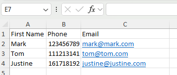
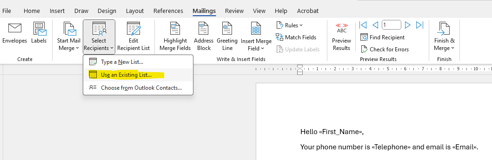

# 📄 DocuMint – Bulk Word Document Generator from Excel Data

**DocuMint** is a web-based document generator that turns Excel spreadsheets into individually customised Word documents using a single template. Perfect for contracts, documents, tenancy forms, and any admin task requiring personalised files — in bulk.

[🟢 Live Demo – Try DocuMint Now](https://documint.onrender.com/)

---

### 🔥 Why DocuMint?

Microsoft Word's Mail Merge is useful — but limited. It only creates one long .docx file with multiple pages for different recipients. You still have to split the document manually.

DocuMint does it better:

Creates separate Word files, one for each row of your Excel spreadsheet

Automatically names each file

Packages them all in a ZIP, ready to download

---

## 🚀 Features

- 📝 Upload a Word `.docx` template with placeholders or merge fields
- 📊 Upload an Excel file with matching column headers
- 🔁 Choose a column to name the generated documents
- 📂 Merge fields into both **paragraphs** and **tables**
- 🗂️ Download a ZIP file with all generated documents
- 🧹 Auto-cleans temporary files after download

---

## ▶️ How to Use

### 1. Prepare Your Excel File
Each row should represent one document. The column headers will become your placeholders.

### 2. Prepare Your Word Template
Use one of the two supported methods:

✅ Option 1: Custom Placeholders
Type placeholders like «First_Name» directly in Word
Replace spaces with underscores to match Excel column names

✅ Option 2: Insert Merge Field (Advanced)
Open Word > Mailings > Select Recipients > Use Existing List…
Load your Excel
Use Insert Merge Field for placeholders (e.g. First_Name)
Save the .docx file

 

---

## 📁 Project Structure

documint/
├── main.py # Flask app
├── requirements.txt # Python dependencies
├── .gitignore # Git ignored files/folders
├── README.md # Project description
├── templates/ # HTML templates
│ ├── index.html
│ └── choose_column.html
├── static/ # Static assets (e.g. logo)
│ └── generated-icon.png
├── uploads/ # Temporary folder for uploaded files
├── output/ # Temporary folder for processed files

---

## ⚙️ Requirements

- Python 3.8+
- `pip install -r requirements.txt` (includes Flask, pandas, python-docx, openpyxl)

---

## 💼 Example Use Cases
Contracts
Letters of offer or employment
Bulk tenancy agreements
Certificates or registration confirmations
School or healthcare document mail-outs

---

## 🔐 Security Notes
Uploaded and generated files are stored only temporarily.
All files are deleted immediately after ZIP download.
